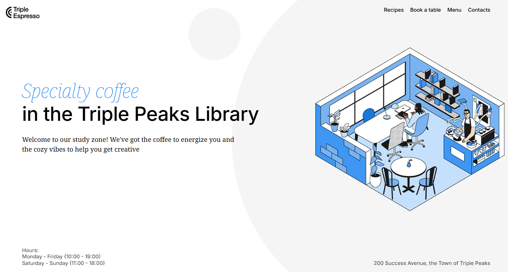
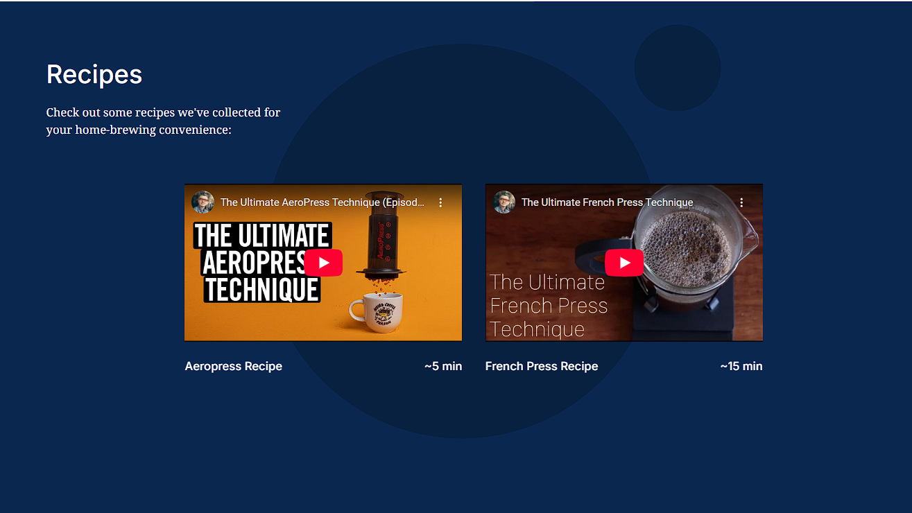
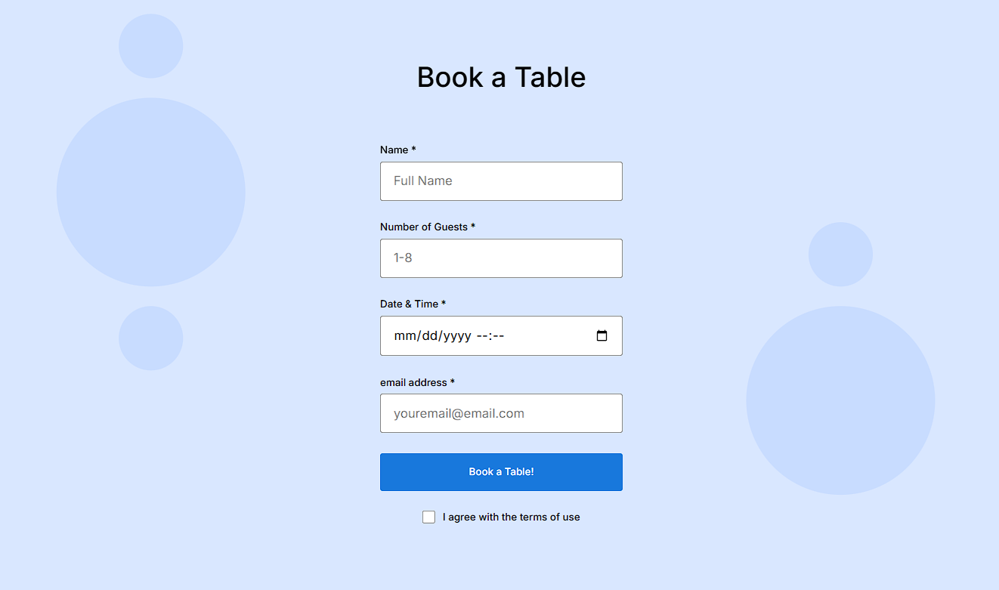
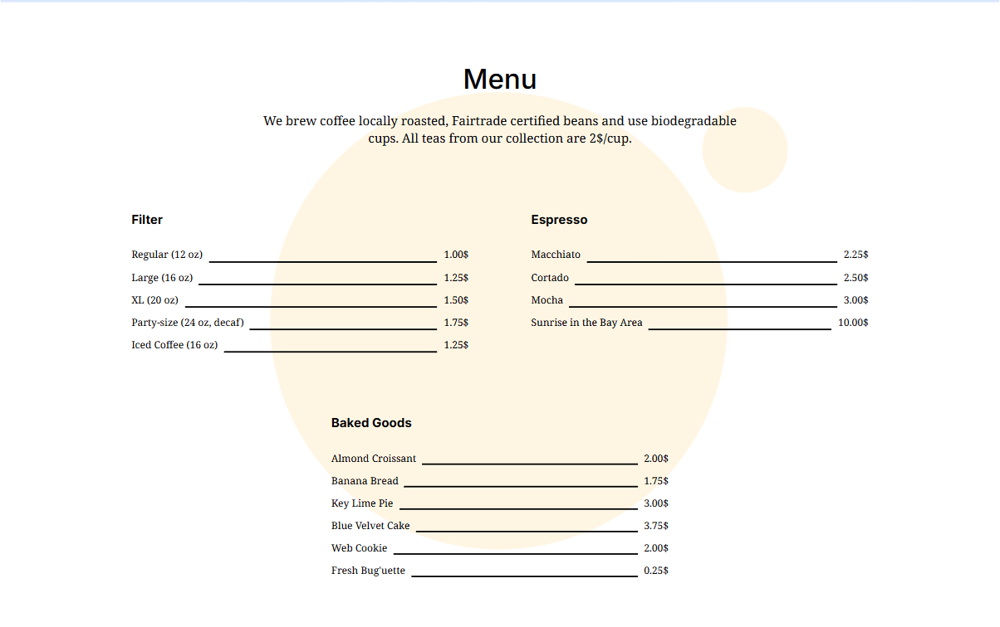
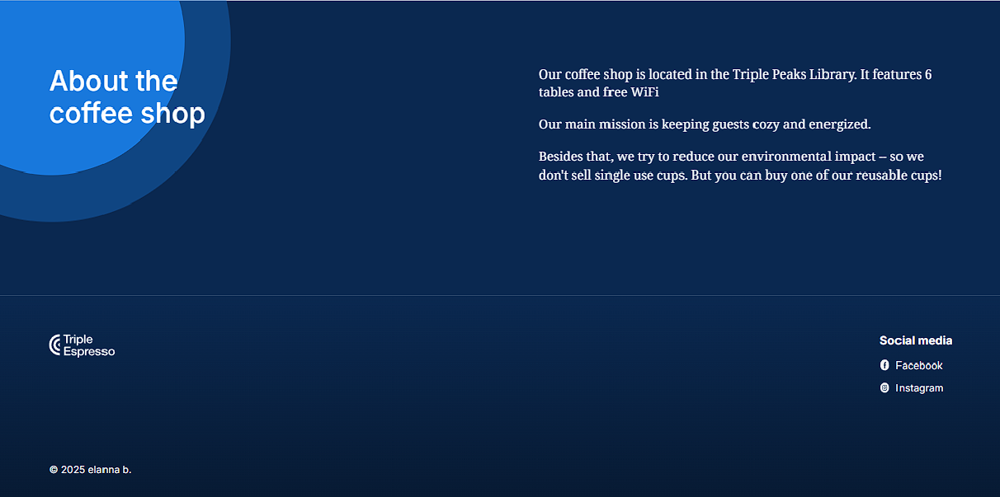

# Project 2 part 3 : Triple Peaks Library

The Triple Peaks Library webpage is the first project in the Software Engineering
program at TripleTen. It was created using HTML and CSS, based on a design brief. This project has several parts. Part 3 is the addition of a form for clients to create reservations that will caputure information pertintent to setting up reservations.

## Project features

- BEM principles
- Flexbox
- Positioning
- nav semantic elements
- anchor tags
- span elements
- margins
- iframe
- forms
- fieldset
- inputs : text, numbers, datetime-local, email
- checkbox
- the use of placeholder for name number and email
- required inputs
- input specific data ie - placeholder not accepted 
  as  input for form
- styling htlm with css
- button
- hover
- pulsate animation using keyframes
- smooth transition hover changing opacity/tranistion colors

Screenshots to date:

